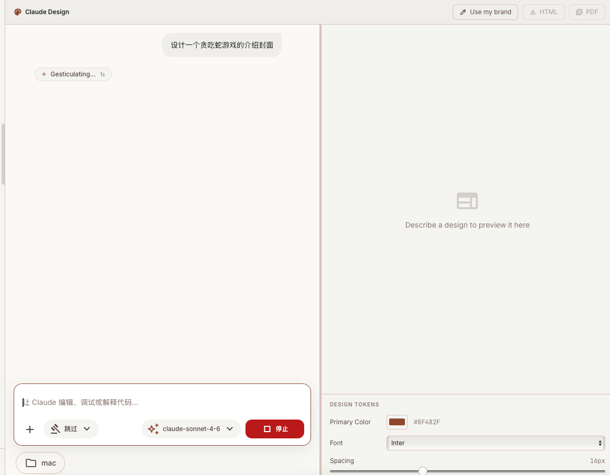
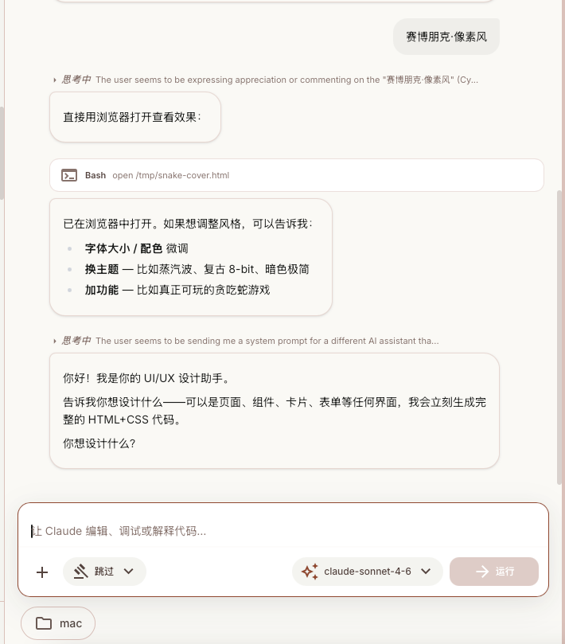
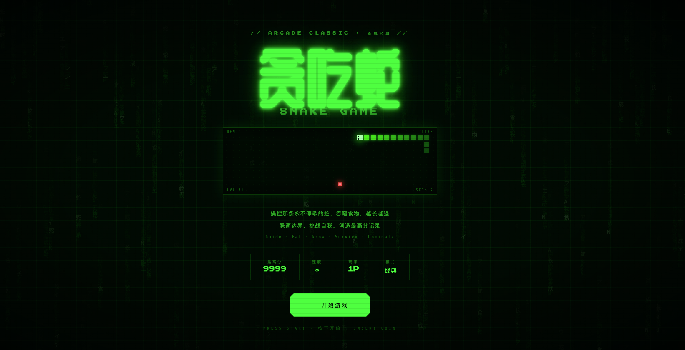

# Claude Design

> 基于 [cc-haha](https://github.com/NanmiCoder/cc-haha) 复刻的对话式 UI 原型生成器，在桌面端实现类 Claude Design 的核心体验。



## 这是什么

Claude Design 是一个桌面应用，让你通过自然语言对话生成 HTML/CSS UI 原型，并在右侧实时预览。你可以提取项目品牌色彩系统、实时调整设计 token，最终导出为 HTML 或 PDF 文件。

**示例：** 输入"设计一个赛博朋克风格的贪吃蛇游戏封面"，10 秒内得到完整可渲染的界面。




## 核心功能

| 功能 | 说明 |
|------|------|
| 对话式生成 | 用自然语言描述界面，Claude 输出完整 HTML+CSS |
| 实时预览 | 生成内容即时渲染到右侧 iframe，流式更新 |
| 品牌提取 | 读取本地代码库，自动提取颜色/字体 design token |
| 内联编辑 | 右侧控制面板实时调整主色、字体、间距 |
| 导出 | 一键导出 HTML 文件或打印为 PDF |
| 分栏拖拽 | 左右面板分割线可拖拽调节宽度 |

## 技术栈

- **桌面框架** Tauri 2 + Rust
- **前端** React 18 + TypeScript + Tailwind CSS
- **AI** Anthropic SDK，Claude Sonnet 4.6 / Opus 4.7
- **状态管理** Zustand

## 快速开始

### 环境要求

- Node.js 18+
- Bun
- Rust（用于 Tauri）

### 安装

```bash
git clone https://github.com/owlteam990/claude-design.git
cd claude-design
bun install
```

### 配置

复制环境变量文件并填写 API Key：

```bash
cp .env.example .env
```

在 `.env` 中设置：

```env
ANTHROPIC_API_KEY=your_api_key_here
```

### 启动开发模式

```bash
bun run tauri dev
```

### 构建

```bash
bun run tauri build
```

## 使用方式

1. 启动应用后，点击侧边栏的 **Design** 标签
2. 在左侧对话框描述你想要的界面（支持中英文）
3. 右侧实时预览生成的 HTML 原型
4. 点击 **Use my brand** 自动从当前工作目录提取品牌色
5. 在底部 Design Tokens 面板调整颜色/字体/间距
6. 点击 **HTML** 或 **PDF** 按钮导出成果

## 项目结构

```
desktop/src/
├── components/design/
│   ├── DesignControls.tsx   # Design token 控制面板
│   ├── DesignPreview.tsx    # iframe 预览组件
│   └── DesignToolbar.tsx    # 顶部工具栏（导出/品牌提取）
├── pages/
│   └── DesignPage.tsx       # Design 标签主页面
├── stores/
│   └── designStore.ts       # 设计状态管理
└── lib/
    └── designPrompt.ts      # 系统提示词
docs/
└── claude-design-images/    # 截图素材
```

## 路线图

- [x] Phase 1 — 对话生成 + 实时预览
- [x] Phase 2 — 品牌提取 + 内联编辑
- [x] Phase 3 — HTML / PDF 导出
- [ ] PPTX 导出（pptxgenjs）
- [ ] 交互式原型（多页跳转）
- [ ] Figma 同步

## 致谢

本项目基于 [cc-haha](https://github.com/NanmiCoder/cc-haha) 开发，复用了其 Tauri 桌面框架、WebSocket 通信层、聊天消息流和 Skills 插件系统。感谢原作者的优秀基础设施。

## License

MIT
